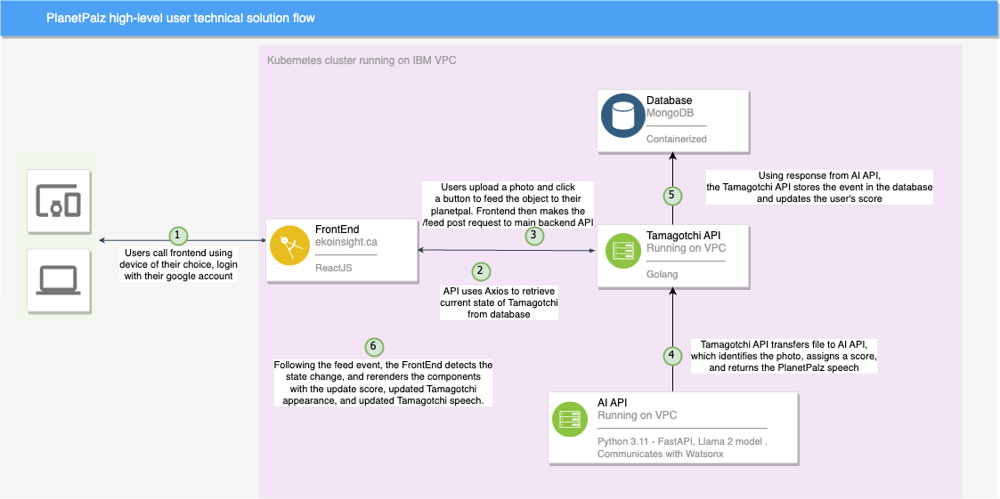
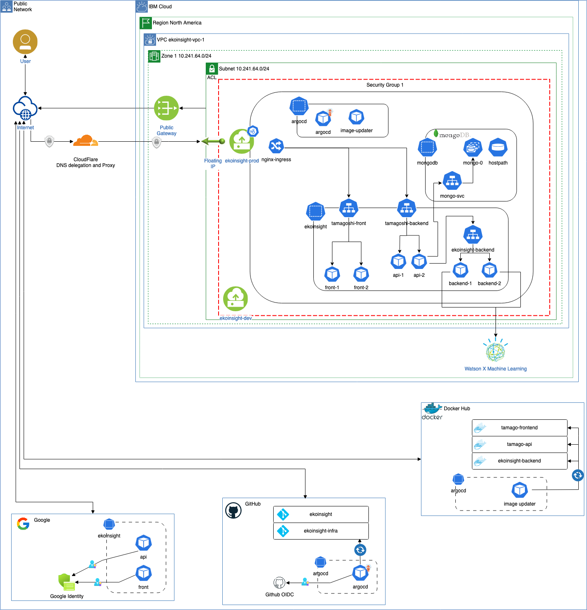
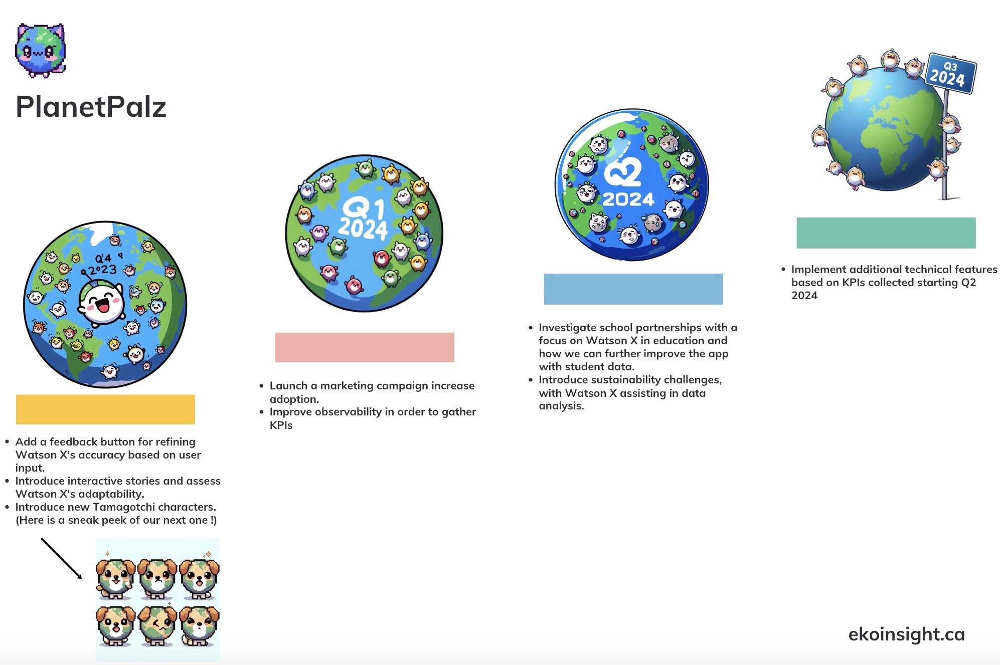

## IBM Call for Code submission: by Alex Keenan, Horia Sandu and Omar Waldmann - Morgan Stanley

# PlanetPalz (previously known as ekoinsight)

- [Project summary](#project-summary)
  - [The issue we are hoping to solve](#the-issue-we-are-hoping-to-solve)
  - [How our technology solution can help](#how-our-technology-solution-can-help)
  - [Our idea](#our-idea)
- [Technology implementation](#technology-implementation)
  - [IBM AI service(s) used](#ibm-ai-services-used)
  - [Other IBM technology used](#other-ibm-technology-used)
  - [Solution architecture](#solution-architecture)
- [Presentation materials](#presentation-materials)
  - [Solution demo video](#solution-demo-video)
  - [Project development roadmap](#project-development-roadmap)
- [Additional details](#additional-details)
  - [How to run the project](#how-to-run-the-project)
  - [Live demo](#live-demo)
- [About this template](#about-this-template)
  - [Authors](#authors)
  - [License](#license)
  - [Acknowledgments](#acknowledgments)

## Project summary

### The issue we are hoping to solve

While formal education about recycling at school is great, cementing this education into daily habits for children requires something a little more dynamic and engaging. Drawing inspiration from the popular tamagotchi game, our app seeks to foster a sense of responsibility towards the environment by encouraging users to take care of their miniature planet-like pet to learn about sustainable practices.

### How our technology solution can help

The PlanetPalz Interactive AI-backed Tamagotchi-style app is designed to foster eco-responsibility and nurturing by engaging users in the care of their digital pet while integrating advanced AI technology for a dynamic and educational experience.

### Our idea

Many of us remember the hit pet caring simulation called Tamagotchi. This simple gadget grabbed the attention of a generation of children who were all thinking about how to take care of their pets on a daily basis. We aim to transfer that same devotion and attention but towards taking care of a digital pet planet earth. 

While on the surface the fun comes from feeding and caring for a cute digital pet, on a deeper level we're looking to help keep sustainability at the top of their minds by having them continuously look for recyclable objects to feed their pets and having educational content in return in the form of their pet's reactions. 

Furthermore, instilling a habit of thinking about recycling has its benefits. Research reveals that students adhering to pro-environmental behaviors tend to be more actively involved in recycling. (https://www.mdpi.com/2673-4060/2/3/21). 

Aiming for this age group is also ideal since early childhood education is particularly influential in shaping attitudes and values, making it a critical period for instilling sustainable practices (https://amshq.org/Blog/2023-05-24-Reduce-Reuse-Recycle-Environmental-Education-in-the-Montessori-Classroom).

The creature is brought to life with textual communications using Watson X and the Llama 2 model, customizable in look (coming soon) and fed by children uploading pictures of recyclable objects from their the real world surroundings. 

With the Blip2 model, we have the capability to discern the contents of an image and relay this data to the LLM. The LLM then processes this information, generating a score and providing an educational response for the creature to compose in return. Currently, this feature is available exclusively in English for our MVP1 version. However, we are in the final stages of development to include support for multiple languages, aiming to ensure our app's accessibility to a diverse global audience.

When an item is deemed recyclable, the creature's well-being is bolstered, leading to a joyful response and the delivery of educational insights about the item. Notably, the creature's physical appearance also undergoes dynamic changes. Conversely, if an item is non-recyclable, the creature's health deteriorates, resulting in a more somber response.

Our plan encompasses an expansion of user interaction options, ranging from engaging in full-fledged conversations with the creature to receiving push notifications that remind users when the tiny pet planet is in need of sustenance.

It's worth acknowledging the evolving nature of AI and image recognition. Enhancing and updating the creature's performance and capabilities can be accomplished seamlessly through a simple API switch.

As a side note, our team underwent a recent shift in our concept, and as a result, our repository and domain name may still display our previous name, "ekoinsight."

## Technology implementation

### IBM AI service(s) used

Utilizing the Llama 2 foundation model, the Watson X system employs prompts to interact with it. It employs Python Langchain to communicate with the underlying Llama 2 base model. The primary purpose of this interaction is to inquire about the sustainability of an item and receive a response imbued with a specific personality. This functionality is triggered by invoking the ApiWatsonX class in the "backend/ekoinsight/app.py" module.

### Other IBM technology used

Our infrastructure provisioning relies on the IBM virtual private cloud using the service  'Virtual Server for VPC.' We maintain two distinct machines for distinct purposes: one dedicated to development and the other serving as the host for user-facing infrastructure. Each of these machines is equipped with a configuration featuring 4 vCPUs and 16 GiB of memory.

To enable routing to our virtual private cloud, we employ the "Floating IP for VPC" service. Through this service, we have allocated two user-accessible IP addresses for our VPC machines.

### Solution architecture

Diagram and step-by-step high-level description of the flow of our solution:

### Infrastructure diagram

Diagram of all the infrastructure we use for a reliant, scalable, and extensible deployment !

## Presentation materials

### Solution demo video

https://www.youtube.com/watch?v=IoCffN-gAz8&ab_channel=AK_RD44

### Project development roadmap

See below for our proposed schedule on next steps after Call for Code 2023 submission.

## Additional details

### How to run the project

While this shouldn't be needed as live production infrastructure is up and running, all components of this project can be built via python, go, and react build tools. Dockerfiles are available to build our APIs, and our images are available on DockerHub.

### Live demo

Our application is available for all platforms at https://ekoinsight.ca. 

For the best experience, choose the "add to home" option on your phone browser to get a React app created and get a native app-like experience.

---

## About this template

### Authors

- **Alex Keenan** - [Morgan Stanley] - [LinkedIn](https://www.linkedin.com/in/alex-keenan/)
- **Horia Sandu** - [Morgan Stanley] - [LinkedIn](https://www.linkedin.com/in/horia-sandu-7a7631162/)
- **Omar Waldmann** - [Morgan Stanley] - [LinkedIn](https://www.linkedin.com/in/omar-waldmann-82b19062/)

### License

This project is licensed under the Apache 2 License - see the [LICENSE](LICENSE) file for details.

### Acknowledgments

- Our React frontend is based on [Creative Tim's Material React components](https://www.creative-tim.com/learning-lab/react/overview/material-kit/).

